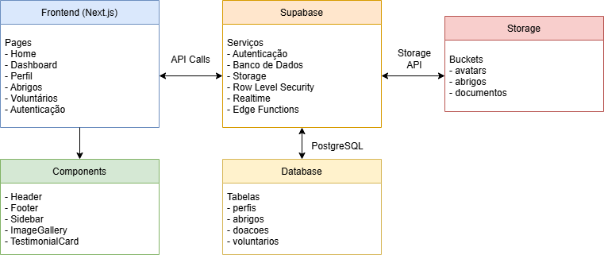
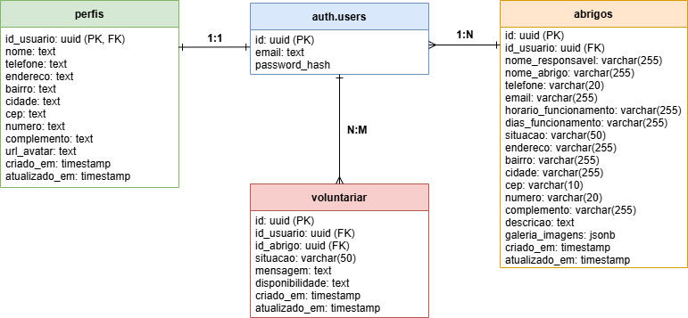

### Voluntários Web
Sistema de gerenciamento de voluntários e abrigos desenvolvido como parte do MBA em Engenharia de Software da Faculdade Impacta.


### Objetivo
Plataforma web para conectar voluntários a abrigos, facilitando o processo de voluntariado e o gerenciamento de instituições do terceiro setor.


### Diagramas
#### Arquitetura do Sistema


*[Arquivo fonte Draw.io](./docs/diagrams/arquitetura-v1.drawio.xml)*

#### Modelo de Dados


*[Arquivo fonte Draw.io](./docs/diagrams/diagrama-entidade-relacionamento-v1.xml)*


### Tecnologias
- **Frontend:** Next.js 14
- **Backend:** Supabase
- **Banco de Dados:** PostgreSQL
- **Autenticação:** Supabase Auth
- **Storage:** Supabase Storage
- **Estilização:** TailwindCSS
- **UI Components:** Shadcn/ui


### Funcionalidades
- ✅ Cadastro e autenticação de usuários
- ✅ Perfil de voluntários
- ✅ Cadastro e gerenciamento de abrigos
- ✅ Sistema de voluntariado
- ✅ Upload de imagens
- ✅ Dashboard administrativo


### Estrutura de Diretórios
```
voluntarios-web/
├── docs/
│   └── diagrams/
│       ├── arquitetura-v1.drawio.xml
│       ├── arquitetura-v1.png
│       ├── diagrama-entidade-relacionamento-v1.png
│       └── diagrama-entidade-relacionamento-v1.xml
├── public/
│   ├── file.svg
│   ├── globe.svg
│   ├── next.svg
│   ├── vercel.svg
│   └── window.svg
├── src/
│   ├── app/
│   │   ├── abrigo/
│   │   ├── atualizar-senha/
│   │   ├── cadastrar/
│   │   ├── dashboard/
│   │   ├── entrar/
│   │   ├── listar-abrigos/
│   │   ├── perfil/
│   │   ├── recuperar-senha/
│   │   ├── voluntario/[id]/
│   │   ├── favicon.ico
│   │   ├── globals.css
│   │   ├── layout.js
│   │   └── page.js
│   ├── components/
│   │   ├── Footer.js
│   │   ├── Header.js
│   │   ├── ImageGallery.js
│   │   ├── Sidebar.js
│   │   └── TestimonialCard.js
│   └── lib/
│       └── supabase.js
├── eslint.config.mjs
├── jsconfig.json
├── middleware.js
├── next.config.mjs
├── package.json
├── postcss.config.mjs
├── tailwind.config.mjs
└── README.md
```

### Como executar
```bash
# Clone o repositório
git clone https://github.com/terceiro-setor-opensource/mba-es-27-grupo-04.git

# Acesse a pasta do projeto
cd mba-es-27-grupo-04

# Instale as dependências
npm install

# Configure as variáveis de ambiente
cp .env.example .env.local

# Execute o projeto
npm run dev
```

### Configuração
Crie um arquivo .env.local na raiz do projeto com as seguintes variáveis:
```
NEXT_PUBLIC_SUPABASE_URL=sua_url_do_supabase
NEXT_PUBLIC_SUPABASE_ANON_KEY=sua_chave_anon_do_supabase
```


### Principais Diretórios
- /docs - Documentação e diagramas do projeto
- /public - Arquivos estáticos
- /src/app - Páginas e rotas da aplicação
- /src/components - Componentes React reutilizáveis
- /src/lib - Configurações e utilidades


### Time
- Cesar Sousa
- Gabriela Lima
- Guilherme Silva
- Wallace
- Thalita Modesto


### Licença
Este projeto está sob a licença MIT.


#### Desenvolvido com ❤️ pela equipe do MBA-ES-27-GRUPO-04